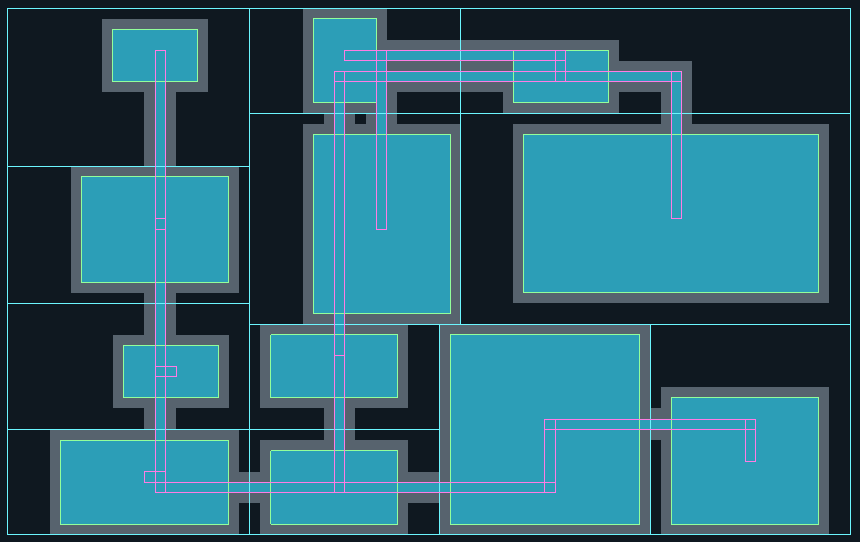
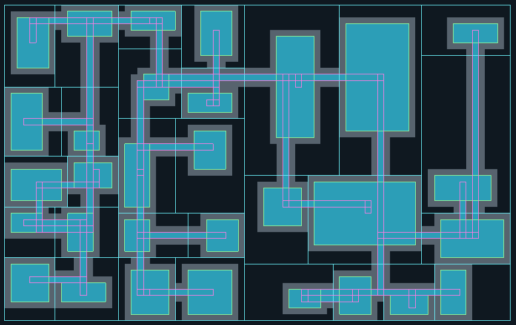
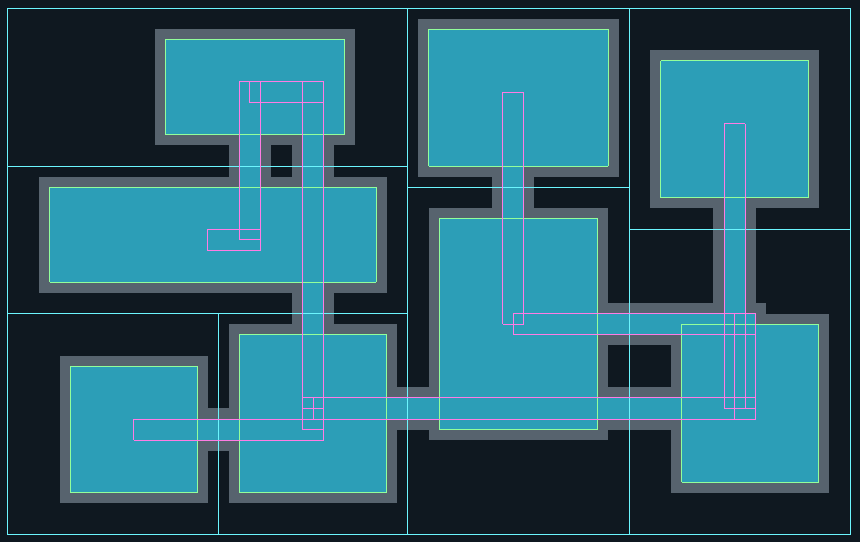
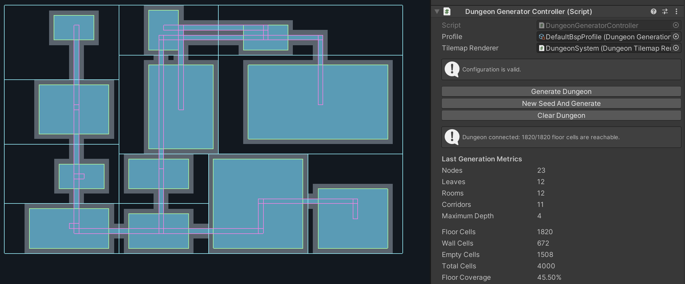

# UnityDungeonBSP

Prototipo didattico di generazione procedurale tramite Binary Space Partitioning.

## Versione

- Unity 2022.3.62f2 LTS
- Apple Silicon
- Template 2D

## Stato della Fase 3

La pipeline implementa:

- configurazione tramite ScriptableObject.
- validazione dei parametri.
- PRNG locale deterministico xorshift32.
- partizionamento BSP ricorsivo.
- generazione di una stanza per ogni foglia.
- collegamento ricorsivo dei sottoalberi con corridoi rettilinei o a L.
- rasterizzazione di stanze e corridoi (conversione delle forme geometriche in celle della griglia).
- costruzione dei muri attorno alle celle di pavimento.
- rendering tramite due Tilemap.
- visualizzazione di debug tramite Gizmos.
- controllo della connettività tramite flood fill a quattro direzioni.
- diagnostica di connettività visibile nell'Inspector.
- metriche strutturali e conteggio delle celle della griglia.
- Inspector personalizzato con validazione, comandi e risultati dell'ultima generazione.
- preset confrontabili.
- test Edit Mode di geometria, determinismo, connettività e metriche.

## Generare un dungeon

1. Aprire `Assets/Scenes/DungeonLab.unity`.
2. Selezionare `DungeonSystem` nella Hierarchy.
3. Assegnare un `DungeonGenerationProfile`.
4. Verificare che l'inspector mostri `Configuration is valid`.
5. Premere `Generate Dungeon`.
6. Verificare che l'Inspector mostri `Dungeon connected`.
7. Leggere le metriche dell'ultima generazione.
8. Osservare il risultato nella Game view o nella Scene view.

Non è necessario entrare in Play Mode.

Il pulsante `New Seed And Generate` assegna un nuovo seed al profilo e rigenera immediatamente la mappa.

Il pulsante `Clear Dungeon` cancella il risultato corrente e pulisce le Tilemap.

## Configurazione di riferimento

| Parametro | Valore |
| --- |---:|
| Map Width | 80 |
| Map Height | 50 |
| Seed | 12345 |
| Max Depth | 4 |
| Min Leaf Width | 12 |
| Min Leaf Height | 10 |
| Aspect Ratio Bias | 1.25 |
| Min Room Width | 6 |
| Min Room Height | 5 | 
| Room Margin | 1 |
| Corridor Width | 1 |

Con questa versione del codice, la configurazione di riferimento produce:

```text
23 nodi
12 foglie
12 stanze
11 corridoi
profondità massima 4
1820 celle di pavimento raggiungibili su 1820
45,50% di copertura del pavimento
```

Lo stesso seed, la stessa configurazione e la stessa versione dell'algoritmo devono produrre la stessa griglia finale.

## Preset

Sono disponibili tre profili in: `Assets/Data/GenerationProfiles`

- `DefaultBspProfile`: configurazione di riferimento.
- `WideRoomsProfile`: meno partizioni, stanze più grandi e corridoi più larghi.
- `DenseRoomsProfile`: più partizioni e stanze più piccole.

I preset di confronto usano lo stesso seed e le stesse dimensioni della mappa, così le differenze osservate dipendono principalmente dai parametri strutturali.

## Debug tramite Gizmos

Il componente `BspGizmoDrawer` permette di mostrare separatamente:

- radice della mappa.
- foglie BSP.
- stanze.
- corridoi.

I Gizmos sono visibili nella Scene view quando `DungeonSystem` è selezionato e il pulsante `Gizmos` è attivo.

Colori utilizzati:

- giallo: regione radice.
- azzurro: foglie BSP.
- verde: stanze.
- rosa: corridoi.

I toggle modificano soltanto la visualizzazione di debug e non rigenerano il dungeon.

## Connettività e metriche

Dopo la rasterizzazione, un flood fill parte dalla prima cella di pavimento e
visita le celle adiacenti nelle quattro direzioni cardinali. Il dungeon è
considerato connesso soltanto quando il numero di celle raggiunte coincide con
il numero totale di celle di pavimento.

L'Inspector riporta lo stato di connettività e le seguenti metriche:

- nodi e foglie BSP.
- stanze e corridoi.
- profondità massima raggiunta.
- celle di pavimento, muro e vuote.
- numero totale di celle.
- percentuale della mappa occupata dal pavimento.

## Screenshot di confronto

### Configurazione di riferimento



### Partizionamento fitto



### Stanze ampie



### Diagnostica di connettività e metriche



## Eseguire i test

1. Aprire `Window > General > Test Runner`.
2. Selezionare `EditMode`.
3. Premere `Run All`.

La suite della Fase 3 contiene 34 casi:

- 8 sul partizionatore BSP.
- 6 sul PRNG deterministico.
- 2 sul posizionamento delle stanze.
- 1 sulla costruzione dei corridoi.
- 3 sulla rasterizzazione, sui muri e sulla griglia completa.
- 13 sulla connettività, inclusi cinque seed espliciti, quattro configurazioni limite e una batteria di 1.000 seed.
- 1 sul calcolo delle metriche.

I test verificano, tra le altre cose:

- riproducibilità con lo stesso seed.
- validità geometrica dell'albero BSP.
- rispetto delle dimensioni minime.
- contenimento delle stanze nelle foglie.
- numero e continuità dei corridoi.
- rasterizzazione completa del pavimento.
- costruzione dei muri senza sovrascrivere il pavimento.
- uguaglianza cella per cella di due generazioni identiche.
- raggiungibilità di tutte le celle di pavimento.
- mappe minime, profonde e strette, oltre a corridoi larghi.
- conteggio coerente di celle e metriche strutturali.

Tutti i test devono risultare verdi prima di modificare la baseline.

## Documentazione tecnica

La scelta e i limiti del PRNG sono descritti in `Documentation/Xorshift32.md`.
